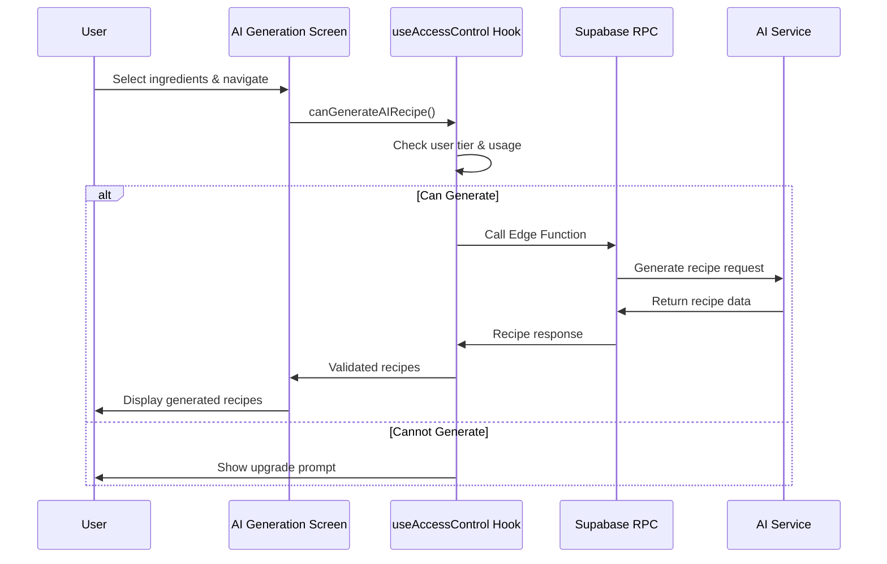
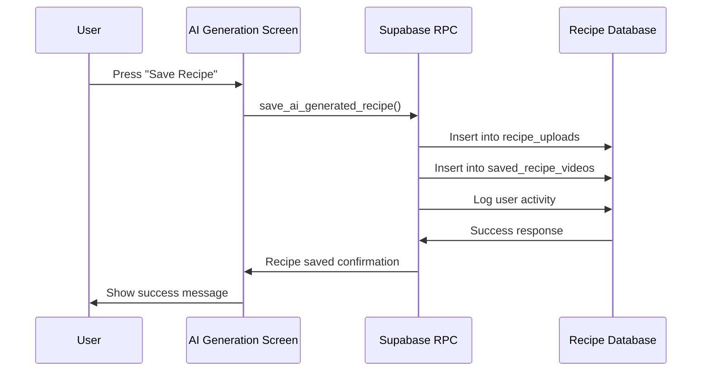

# AI Recipe Generation Component Documentation

## 📋 Table of Contents

1. [Overview](#overview)
2. [Architecture](#architecture)
3. [Component Structure](#component-structure)
4. [Data Flow](#data-flow)
5. [Access Control System](#access-control-system)
6. [Backend Integration](#backend-integration)
7. [Frontend Implementation](#frontend-implementation)
8. [API Reference](#api-reference)
9. [User Experience](#user-experience)
10. [Error Handling](#error-handling)
11. [Performance Considerations](#performance-considerations)
12. [Testing Guidelines](#testing-guidelines)
13. [Deployment Notes](#deployment-notes)
14. [Future Enhancements](#future-enhancements)

---

## 🎯 Overview

The AI Recipe Generation Component is a core feature of KitchAI v2 that enables users to generate personalized recipes based on their selected pantry ingredients. The system leverages artificial intelligence to create realistic, detailed recipes while implementing a sophisticated access control system for different user tiers.

### Key Features

- **Intelligent Recipe Generation**: Creates multiple recipe variations from selected ingredients
- **Tier-Based Access Control**: FREEMIUM (10/month), PREMIUM (unlimited), CREATOR (unlimited)
- **Real-time Usage Tracking**: Monitors and displays usage limits
- **Recipe Validation**: Ensures generated recipes only use selected ingredients
- **Save & Share Functionality**: Integrates with the app's recipe management system
- **Enhanced User Experience**: Loading animations, multiple recipe options, and intuitive navigation

---

## 🏗️ Architecture

### System Architecture Diagram

```
┌─────────────────┐    ┌──────────────────┐    ┌─────────────────┐
│   User Interface │◄──►│  Access Control  │◄──►│  Backend RPC    │
│                 │    │     System       │    │   Functions     │
└─────────────────┘    └──────────────────┘    └─────────────────┘
         │                        │                       │
         ▼                        ▼                       ▼
┌─────────────────┐    ┌──────────────────┐    ┌─────────────────┐
│  Recipe Display │    │ Usage Tracking & │    │   AI Service    │
│   & Validation  │    │ Limit Enforcement│    │  Integration    │
└─────────────────┘    └──────────────────┘    └─────────────────┘
```

### Component Layers

1. **Presentation Layer**: React Native UI components and screens
2. **Business Logic Layer**: Custom hooks for access control and state management
3. **Data Access Layer**: Supabase RPC functions and Edge Functions
4. **External Services**: AI providers (OpenAI, Claude, etc.)

---

## 📁 Component Structure

### Primary Files

```
src/
├── screens/recipe-generation/
│   └── AIRecipeGenerationScreen.tsx     # Main UI component
├── hooks/
│   └── useAccessControl.ts              # Access control logic
├── navigation/
│   └── types.ts                         # Type definitions
└── services/
    └── supabase.ts                      # Database integration

supabase/
├── functions/
│   └── generate-recipe/                 # Edge Function (AI integration)
└── migrations/
    └── ai_recipe_tables.sql            # Database schema
```

### Supporting Documentation

```
docs/
├── BACKEND_RPC_INSTRUCTIONS.md         # Backend implementation guide
├── FRONTEND_CURRENT_STATE.md           # Current system state
├── AI_RECIPE_SAVED_TAB_FIX.md         # Recipe saving implementation
└── BACKEND_AI_RECIPE_CONSTRAINT_FIX.md # Ingredient validation
```

---

## 🔄 Data Flow

### 1. Recipe Generation Flow



### 2. Recipe Saving Flow



---

## 🔐 Access Control System

### User Tiers & Limits

| Tier | AI Recipes/Month | Access Level | Features |
|------|------------------|--------------|----------|
| **FREEMIUM** | 10 recipes | Limited | Basic generation, save recipes |
| **PREMIUM** | Unlimited | Full | All features, priority support |
| **CREATOR** | Unlimited | Full | All features + creator tools |

### Implementation Details

```typescript
// Access Control Hook Structure
interface UseAccessControlReturn {
  // Access checks
  canPerformScan: () => boolean;
  canGenerateAIRecipe: () => boolean;
  
  // Actions with access control
  generateAIRecipe: (recipeData: any) => Promise<AIRecipeData[]>;
  
  // Usage display
  getUsageDisplay: () => UsageDisplayData;
  
  // State
  isProcessing: boolean;
  FREEMIUM_AI_RECIPE_LIMIT: number;
}
```

### Usage Tracking

The system tracks usage in the `user_usage_limits` table:

```sql
CREATE TABLE user_usage_limits (
  user_id UUID PRIMARY KEY REFERENCES auth.users(id),
  ai_recipe_count INTEGER DEFAULT 0,
  scan_count INTEGER DEFAULT 0,
  last_reset TIMESTAMP WITH TIME ZONE DEFAULT NOW(),
  created_at TIMESTAMP WITH TIME ZONE DEFAULT NOW(),
  updated_at TIMESTAMP WITH TIME ZONE DEFAULT NOW()
);
```

---

## 🔌 Backend Integration

### Edge Function Architecture

The system uses Supabase Edge Functions for AI integration:

```typescript
// Edge Function: supabase/functions/generate-recipe/index.ts
const response = await fetch(`${supabaseUrl}/functions/v1/generate-recipe`, {
  method: 'POST',
  headers: {
    'Content-Type': 'application/json',
    'Authorization': `Bearer ${supabaseAnonKey}`,
  },
  body: JSON.stringify({
    user_id: user.id,
    ingredients: selectedIngredients,
    dietary_preferences: {},
    cuisine_style: 'any',
    difficulty: 'Medium',
    prep_time: 45,
    servings: 4,
  })
});
```

### RPC Functions

#### 1. `generate_ai_recipe`

```sql
CREATE OR REPLACE FUNCTION generate_ai_recipe(
  p_user_id UUID,
  p_recipe_data JSONB
)
RETURNS JSONB
```

**Purpose**: Generate AI recipes with access control
**Returns**: Recipe data with usage information

#### 2. `save_ai_generated_recipe`

```sql
CREATE OR REPLACE FUNCTION save_ai_generated_recipe(
  p_user_id UUID,
  p_recipe_data JSONB,
  p_selected_ingredients TEXT[]
)
RETURNS JSONB
```

**Purpose**: Save generated recipes to user's collection
**Returns**: Success status and recipe ID

---

## 💻 Frontend Implementation

### Main Component: AIRecipeGenerationScreen

```typescript
interface AIRecipeData {
  name: string;
  ingredients: string[];
  optional_additions?: string[];
  steps: string[];
  estimated_time: number;
  servings: number;
  difficulty: string;
  estimated_cost?: string;
  nutrition_notes?: string;
  ai_confidence_score?: number;
}
```

### Key Features

1. **Loading Animation System**
   ```typescript
   const generationSteps = [
     'Analyzing your ingredients...',
     'Finding perfect flavor combinations...',
     'Creating multiple recipe options...',
     'Ranking recipes by confidence...',
     'Your top 3 recipes are ready!'
   ];
   ```

2. **Recipe Validation**
   ```typescript
   const validateRecipeIngredients = useCallback((recipe: AIRecipeData, selectedIngredients: string[]) => {
     // Ensures recipes only use selected ingredients
     // Moves invalid ingredients to optional_additions
   }, []);
   ```

3. **Multiple Recipe Navigation**
   ```typescript
   const [currentRecipeIndex, setCurrentRecipeIndex] = useState(0);
   // Users can navigate between generated recipe variations
   ```

### State Management

```typescript
const [isGenerating, setIsGenerating] = useState(false);
const [generatedRecipes, setGeneratedRecipes] = useState<AIRecipeData[]>([]);
const [currentRecipeIndex, setCurrentRecipeIndex] = useState(0);
const [generationStep, setGenerationStep] = useState(0);
const [error, setError] = useState<string | null>(null);
```

---

## 📊 API Reference

### Request Format

```typescript
interface AIRecipeRequest {
  selected_ingredients: string[];
  user_preferences?: {
    difficulty?: 'Easy' | 'Medium' | 'Hard';
    servings?: number;
    max_prep_time?: number;
    cuisine_style?: string;
  };
  dietary_restrictions?: string[];
  request_multiple?: boolean;
}
```

### Response Format

```typescript
interface AIRecipeResponse {
  success: boolean;
  data: AIRecipeData[] | AIRecipeData;
  usage_info?: {
    remaining_generations?: number;
    tier: 'FREEMIUM' | 'PREMIUM' | 'CREATOR';
  };
  error?: string;
}
```

### Error Codes

| Code | Description | Action |
|------|-------------|--------|
| `LIMIT_EXCEEDED` | User reached monthly limit | Show upgrade prompt |
| `INVALID_INGREDIENTS` | Less than 2 ingredients provided | Request more ingredients |
| `AI_SERVICE_ERROR` | External AI service failure | Show retry option |
| `USER_NOT_AUTHENTICATED` | Missing user session | Redirect to login |

---

## 🎨 User Experience

### Loading States

1. **Generation Animation**: Pulsing AI icon with rotating messages
2. **Step Progression**: 5-step loading process with realistic timing
3. **Minimum Load Time**: 3-second minimum for better perceived quality

### Recipe Display

1. **Recipe Cards**: Swipeable cards for multiple variations
2. **Confidence Indicators**: Visual confidence scores (85-95%)
3. **Ingredient Validation**: Clear separation of available vs. optional ingredients
4. **Action Buttons**: Save, regenerate, and navigation controls

### Accessibility Features

- **Screen Reader Support**: All elements have proper accessibility labels
- **High Contrast**: Color schemes that meet WCAG guidelines
- **Large Touch Targets**: Minimum 44px touch targets for all interactive elements

---

## ⚠️ Error Handling

### Client-Side Error Handling

```typescript
try {
  const result = await generateAIRecipe(recipeRequestData);
  if (result) {
    setGeneratedRecipes(validatedRecipes);
  } else {
    throw new Error('Failed to generate recipe');
  }
} catch (error: any) {
  console.error('[AIRecipeGeneration] Generation error:', error);
  setError(error.message || 'Failed to generate recipe');
  setIsGenerating(false);
}
```

### Backend Error Handling

```sql
EXCEPTION
  WHEN OTHERS THEN
    RETURN jsonb_build_object(
      'success', false,
      'error', 'Internal server error: ' || SQLERRM,
      'error_code', 'INTERNAL_ERROR'
    );
```

### Error Recovery Strategies

1. **Automatic Retry**: For transient network errors
2. **Fallback Recipes**: Basic recipe templates when AI fails
3. **Graceful Degradation**: Simplified UI when features unavailable
4. **User Feedback**: Clear error messages with actionable steps

---

## ⚡ Performance Considerations

### Frontend Optimizations

1. **Lazy Loading**: Components loaded only when needed
2. **Memoization**: `useCallback` and `useMemo` for expensive operations
3. **Animation Performance**: Native driver for smooth animations
4. **State Optimization**: Minimal re-renders with proper state structure

### Backend Optimizations

1. **Connection Pooling**: Efficient database connection management
2. **Caching Strategy**: Redis caching for frequently accessed data
3. **Rate Limiting**: Prevents abuse and ensures fair usage
4. **Asynchronous Processing**: Non-blocking AI service calls

### AI Service Integration

1. **Request Batching**: Generate multiple recipes in single API call
2. **Response Caching**: Cache similar ingredient combinations
3. **Timeout Handling**: 30-second timeout with fallback
4. **Token Optimization**: Efficient prompt engineering

---

## 🧪 Testing Guidelines

### Unit Tests

```typescript
describe('AIRecipeGenerationScreen', () => {
  test('validates recipe ingredients correctly', () => {
    const recipe = { ingredients: ['chicken', 'rice', 'unknown'] };
    const selected = ['chicken', 'rice'];
    const validated = validateRecipeIngredients(recipe, selected);
    expect(validated.ingredients).toEqual(['chicken', 'rice']);
    expect(validated.optional_additions).toContain('unknown (not in pantry)');
  });
});
```

### Integration Tests

```typescript
describe('AI Recipe Generation Flow', () => {
  test('generates and saves recipe successfully', async () => {
    const mockUser = { id: 'test-user-id' };
    const mockIngredients = ['chicken', 'rice', 'vegetables'];
    
    // Test complete flow from generation to saving
    const result = await generateAndSaveRecipe(mockUser, mockIngredients);
    expect(result.success).toBe(true);
    expect(result.recipe_id).toBeDefined();
  });
});
```

### E2E Tests

1. **User Journey Tests**: Complete flow from ingredient selection to recipe saving
2. **Access Control Tests**: Verify tier-based limitations work correctly
3. **Error Handling Tests**: Test various failure scenarios
4. **Performance Tests**: Ensure acceptable response times

---

## 🚀 Deployment Notes

### Environment Variables

```bash
# Frontend (.env)
EXPO_PUBLIC_SUPABASE_URL=https://your-project.supabase.co
EXPO_PUBLIC_SUPABASE_ANON=your-anon-key

# Backend (Supabase)
OPENAI_API_KEY=your-openai-key
CLAUDE_API_KEY=your-claude-key (optional)
```

### Database Migrations

```sql
-- Run in sequence:
1. ai_recipe_generations_table.sql
2. user_usage_limits_updates.sql
3. recipe_uploads_ai_columns.sql
4. access_control_rpc_functions.sql
```

### Edge Function Deployment

```bash
supabase functions deploy generate-recipe --project-ref your-project-ref
```

### Feature Flags

```typescript
const FEATURE_FLAGS = {
  AI_RECIPE_GENERATION: true,
  MULTIPLE_RECIPE_VARIATIONS: true,
  ENHANCED_VALIDATION: true,
  USAGE_ANALYTICS: true,
};
```

---

## 🔮 Future Enhancements

### Planned Features

1. **Advanced Dietary Preferences**
   - Allergen detection and avoidance
   - Nutritional goal targeting
   - Cultural dietary restrictions

2. **Enhanced AI Capabilities**
   - Image-based recipe generation
   - Voice-to-recipe conversion
   - Cooking technique recommendations

3. **Social Features**
   - Recipe sharing and collaboration
   - Community recipe rating
   - AI recipe challenges

4. **Personalization**
   - Learning from user preferences
   - Seasonal ingredient suggestions
   - Cooking skill adaptation

### Technical Improvements

1. **Performance Optimizations**
   - GraphQL integration for efficient data fetching
   - Progressive Web App (PWA) support
   - Offline recipe generation

2. **Advanced Analytics**
   - Recipe success tracking
   - Ingredient usage patterns
   - User engagement metrics

3. **Enhanced Error Recovery**
   - Circuit breaker pattern for AI services
   - Intelligent retry strategies
   - Real-time error monitoring

---

## 📚 Additional Resources

### Related Documentation
- [Backend RPC Instructions](./BACKEND_RPC_INSTRUCTIONS.md)
- [Access Control System](./docs/hooks/useAccessControl.md)
- [Database Schema Reference](./supabase/migrations/)
- [API Testing Guide](./docs/testing/api-testing.md)

### External Dependencies
- [Supabase Documentation](https://supabase.com/docs)
- [OpenAI API Reference](https://platform.openai.com/docs/api-reference)
- [React Native Documentation](https://reactnative.dev/docs/getting-started)

### Support & Maintenance
- **Component Owner**: AI Development Team
- **Code Review**: Required for all changes
- **Monitoring**: DataDog alerts for error rates and response times
- **Support**: Slack #ai-recipe-support channel

---

*Last Updated: December 2024*  
*Version: 2.1.0*  
*Maintained by: KitchAI Development Team* 